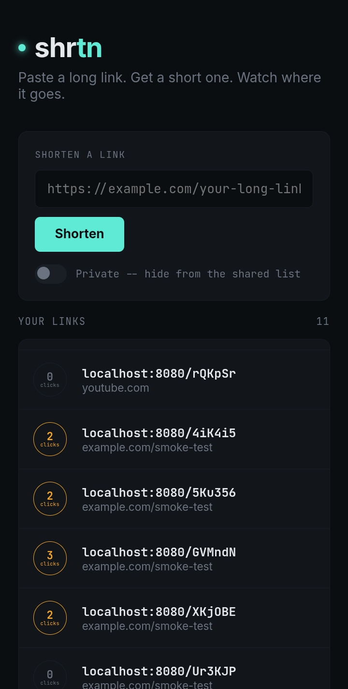

# Shrtn

<p align="center">
  
  
  
  
</p>

<p align="center">
  <a href="https://github.com/privateMwb/Shrtn/actions/workflows/build.yml">
    
  </a>
  <a href="https://github.com/privateMwb/Shrtn/actions/workflows/frontend.yml">
    
  </a>
  <a href="https://github.com/privateMwb/Shrtn/actions/workflows/sanitizers.yml">
    
  </a>
  <a href="https://github.com/privateMwb/Shrtn/actions/workflows/clang-tidy.yml">
    
  </a>
  <a href="https://github.com/privateMwb/Shrtn/actions/workflows/clang-format.yml">
    
  </a>
  <a href="https://github.com/privateMwb/Shrtn/actions/workflows/docs.yml">
    
  </a>
  <a href="https://github.com/privateMwb/Shrtn/actions/workflows/release.yml">
    
  </a>
</p>

<p align="center">
  
  
</p>

Shrtn is a URL shortener built on [FalconHTTP](https://github.com/privateMwb/FalconHTTP) and [MiniDB](https://github.com/privateMwb/MiniDB) — a C++ backend that generates short codes, tracks click counts, and exposes `/api/metrics` for [FalconEye](https://github.com/privateMwb/FalconEye) to poll, paired with a React frontend for creating and browsing links.

<p align="center">
  
</p>

> The screenshot above is a placeholder path (`docs/assets/shrtn.png`) —
> add a real capture of the running frontend there before publishing.

**Live demo:** [shrtn-nine.vercel.app](https://shrtn-nine.vercel.app)

## 📑 Table of Contents

- [Features](#features)
- [Requirements](#requirements)
- [Dependencies](#dependencies)
- [Installation](#installation)
- [Quick Start](#quick-start)
- [Project Structure](#project-structure)
- [Development](#development)
- [Deployment](#deployment)
- [Known Limitations](#known-limitations)
- [Documentation](#documentation)
- [Contributing](#contributing)
- [Changelog](#changelog)
- [License](#license)

## <a id="features"></a>✨ Features

- **Short code generation** — random 6-character base62 codes, with bounded collision-retry (5 attempts; at a 62⁶ ≈ 56.8 billion keyspace, exhaustion isn't a realistic outcome at any scale this project would hit).
- **Click tracking** — `GET /:code` redirects with `302 Found` and increments the link's click count on every visit.
- **Private links** — `POST /shorten` accepts an optional `private` flag. Private links are excluded from the shared `GET /links` listing; the creator's own browser remembers the code locally and polls `GET /api/links/:code` to keep seeing its live click count. Not access control — see [Known Limitations](#known-limitations).
- **Built-in observability** — request/DB timing wired through via `Metrics`/`DbTiming.h`/`MetricsJson.h` (vendored unchanged from FalconEye), with `dbInsert`, `dbLookup`, and `dbClickIncrement` breakdowns exposed at `/api/metrics` for FalconEye's dashboard to render.
- **Input validation with teeth** — rejects non-http(s) schemes (including `javascript:`/`data:`) and URLs over 2048 characters, both server-side; the frontend mirrors the check but the server is the actual boundary.

## <a id="requirements"></a>📋 Requirements

- A C++23-conformant compiler — verified on GCC and Clang, Linux/Termux (see [Known Limitations](#known-limitations))
- CMake 3.20+
- Node.js 20+ and npm, for the frontend
- Git submodules initialized — Shrtn is a consumer application built on two of this author's own projects (see [Dependencies](#dependencies)) and needs their source present to build

## <a id="dependencies"></a>🔗 Dependencies

| Dependency | Provides | Repository |
|---|---|---|
| FalconHTTP | The HTTP server, router, and middleware chain Shrtn's routes are written against | [privateMwb/FalconHTTP](https://github.com/privateMwb/FalconHTTP) |
| MiniDB | The embedded database backing the `urls` table | [privateMwb/MiniDB](https://github.com/privateMwb/MiniDB) |

Both are vendored as git submodules under `server/third_party/` and built from source via `add_subdirectory()` — there is no package manager step, since each submodule already vendors its own dependencies.

**Frontend:** React 18 and Vite — managed normally via `frontend/package.json`. No chart or icon library; the UI is hand-styled.

## <a id="installation"></a>📦 Installation

```bash
git clone --recurse-submodules https://github.com/privateMwb/Shrtn.git
cd Shrtn
```

**Server:**

```bash
cd server
cmake -B build
cmake --build build
mkdir -p data   # must exist before first run -- StorageEngine won't create it
./build/Shrtn_server
```

**Frontend**, in a separate terminal:

```bash
cd frontend
npm install
npm run dev
```

Open `http://localhost:5173` — the frontend talks to the backend on `http://localhost:8080`.

## <a id="quick-start"></a>🚀 Quick Start

```bash
# Shorten a link
curl -X POST http://localhost:8080/shorten \
  -H "Content-Type: application/json" \
  -d '{"url": "https://example.com"}'
# => {"code": "j3dche"}

# Visit it -- 302 redirect, click count increments
curl -i http://localhost:8080/j3dche

# See every public link
curl http://localhost:8080/links
```

Full endpoint reference, including `private` links and `/api/metrics`'s response shape: [`docs/API.md`](docs/API.md).

## <a id="project-structure"></a>🗂️ Project Structure

```
Shrtn/
├── server/
│   ├── include/
│   │   ├── Metrics.h
│   │   ├── DbTiming.h
│   │   ├── MetricsJson.h
│   │   └── ShrtnDb.h
│   ├── src/
│   │   ├── main.cpp
│   │   └── routes/
│   │       └── UrlRoutes.h
│   ├── third_party/
│   │   ├── falconhttp/
│   │   └── minidb/
│   └── CMakeLists.txt
│
├── frontend/
│   ├── src/
│   │   ├── main.jsx
│   │   └── ShrtnApp.jsx
│   ├── index.html
│   ├── package.json
│   └── vite.config.js
│
├── docs/
│   ├── Doxyfile
│   ├── API.md
│   └── assets/
│       └── shrtn.png
│
├── scripts/
│   └── smoke_test.sh
│
├── .github/
│   ├── releases/
│   └── workflows/
│
├── .clang-format
├── .clang-tidy
├── .gitignore
├── Dockerfile
├── init-nested-submodules.sh
├── README.md
└── LICENSE
```

## <a id="development"></a>🛠️ Development

**Build the server** (Debug by default):

```bash
cd server
cmake -B build -DCMAKE_BUILD_TYPE=Debug
cmake --build build
```

**Run the frontend dev server:**

```bash
cd frontend
npm run dev
```

**Check formatting and static analysis locally**, same checks CI runs:

```bash
find server/include server/src \( -name "*.h" -o -name "*.cpp" \) -exec clang-format --dry-run --Werror {} +
clang-tidy -p server/build $(find server/include server/src -name "*.h" -o -name "*.cpp")
```

**Build the frontend for production:**

```bash
cd frontend
npm run build
```

**Run the smoke test** against a live instance:

```bash
cd scripts
./smoke_test.sh http://localhost:8080
```

## <a id="deployment"></a>☁️ Deployment

Split across two very different targets — worth being precise about which does what, since it's easy to assume one platform covers both:

**Frontend → Vercel.** `frontend/` is a static Vite build with no server-side logic of its own, which is exactly what Vercel's free Hobby tier is built for — no credit card required, deploy on push. Set `VITE_API_BASE` (Vercel project → Environment Variables) to the backend's real Render URL before deploying — see `frontend/.env.example`.

**Backend → *not* Vercel.** This is worth making explicit: Vercel cannot run Shrtn's backend. `server/` is a long-running process that binds a persistent TCP port (`server.start(8080)` + `server.run()`, blocking forever) — Vercel's model is serverless functions that spin up per-request and exit, with no persistent port binding and no durable filesystem for `./data/shrtn.json` to live on.

The backend deploys to **Render** instead, built via the repo's `Dockerfile`:

- **Nested submodules need an explicit init step.** Render clones this repo's own submodules (`server/third_party/minidb`, `server/third_party/falconhttp`) automatically, but doesn't recurse into *their* `.gitmodules` (e.g. MiniDB's own vendored `JsonParser`/`ThreadPoolPro`). `init-nested-submodules.sh` walks the tree for every `.gitmodules` file and clones anything still empty — it works without `.git` metadata, since `.gitmodules` is a plain tracked file that survives a Docker `COPY`. The Dockerfile runs it before configuring CMake.
- **Multi-stage build** — an `ubuntu:24.04` build stage with the full toolchain (`build-essential`, `cmake`, `git`) compiles `Shrtn_server` in `Release` mode with the example/test/benchmark/regression submodule targets all off; the final image is a clean `ubuntu:24.04` with only `libstdc++6` and the compiled binary, keeping the deployed image small.
- **`/app/data` is created at build time, inside the image layer** — meaning, as currently configured, it is **not** a persistent volume. See [Known Limitations](#known-limitations) for what that means for data survival across redeploys.

So: two independent deploys, not one platform doing both.

## <a id="known-limitations"></a>⚠️ Known Limitations

- **No auth, no accounts.** `GET /links` is a single list shared by every visitor to the deployed instance.
- **Private links are unlisted, not access-controlled.** The `private` flag only excludes a link from `GET /links`. Anyone with (or who guesses) the code can still visit it via `GET /:code`, and `GET /api/links/:code` never checks the flag either.
- **No schema migration path.** Changing the `urls` table (as already happened once, adding `isPrivate`) requires deleting `./data/shrtn.json` and starting fresh — there's no upgrade path for existing data.
- **No rate limiting** on `POST /shorten` or `GET /links`.
- **Click-count increment failures are silent.** `GET /:code`'s redirect succeeds either way; a failed count update currently has zero visibility anywhere, including `/api/metrics`.
- **No automated test suite.** `server/` has no `tests/` directory — `scripts/smoke_test.sh` exercises the live server end-to-end via curl, but it's a manual/CI-boot-time check, not a sanitized unit-test suite, and there's no code coverage reporting as a result.
- **`/app/data` is not a persistent volume on Render as currently deployed.** Every redeploy (and, on Render's free tier, every spin-down after 15 minutes of inactivity) rebuilds the container from the Docker image, resetting `shrtn.json` to empty. All shortened links are lost when this happens. Attaching a Render persistent disk mounted at `/app/data` would fix this, at Render's paid-tier cost.

## <a id="documentation"></a>📖 Documentation

Full API reference, generated with Doxygen from `docs/Doxyfile`:

**https://privateMwb.github.io/Shrtn/**

Endpoint-level reference (request/response shapes, status codes): [`docs/API.md`](docs/API.md)

## <a id="contributing"></a>🤝 Contributing

Issues and pull requests are welcome. Before submitting a PR:

- Run `clang-format` and `clang-tidy` locally (see [Development](#development)) — CI enforces both
- Run `scripts/smoke_test.sh` against your local build before opening a PR that touches `server/`
- If your change touches `ShrtnDb`'s locking (`tryInsertUrl`, `findByCode`, `incrementClickCount`), note in your PR description how you verified it under concurrent load (the `sanitizers.yml` TSan job is the closest thing to a regression check for this today)

## <a id="changelog"></a>📝 Changelog

See the [Releases](https://github.com/privateMwb/Shrtn/releases) page for version history and release notes.

## <a id="license"></a>📄 License

MIT — see [LICENSE](LICENSE) for details.
